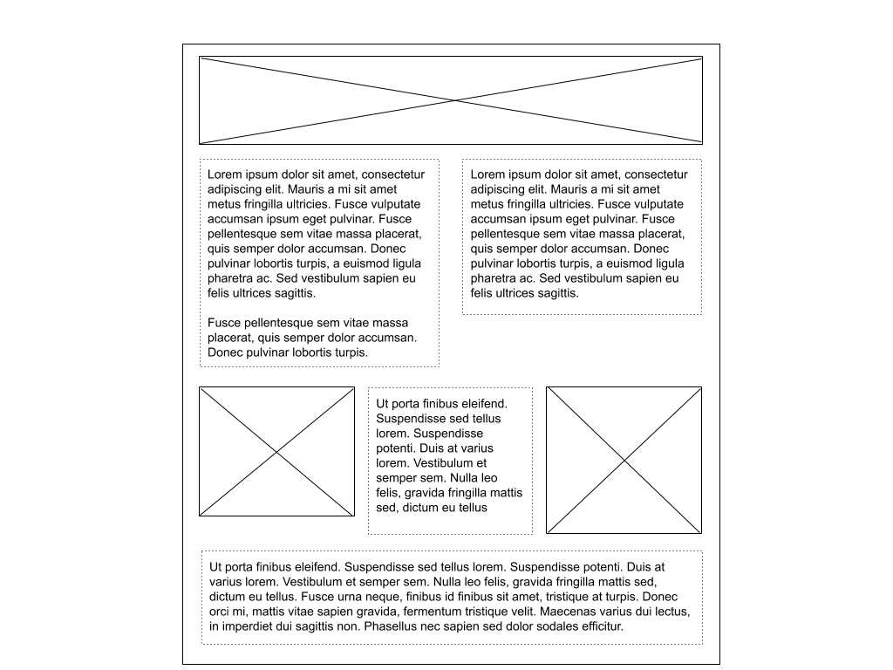
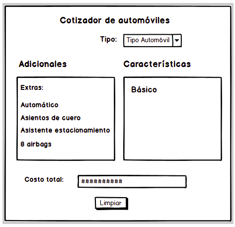

# I1

**Pauta general:** Pueden existir errores menores de sintaxis o métodos con nombres ligeramente distintos al correcto. Revisar supuestos escritos en las respuestas.

## Pregunta 1 (1 pts):

En los libros de fantasía son habituales los seres de todo tipo: humanos, elfos, enanos, hobbits, ogros, orcos, trolles, magos, etc.

Dada la clase "raíz" llamada "*being*" (ser) que tiene los siguientes atributos:

* `name`, que es el nombre propio (Shrek, Gandalf, Legolas, Fiona)
* `skill`, un número mayor a cero que indica el nivel de habilidad o skill.


Y los métodos/funciones:

* `greet()`, que retorna un mensaje en consola que dice: "hi, my name is ... ,I'm a ... and my ability is to ... ."
* `train()`, que incrementa la habilidad (*skill*) en 10 puntos al ser/personaje.
* `setSkill(number)`, que otorga ese number como *skill*  al ser/personaje.
* `getSkill()`, que retorna el *skill* (número) asociado al ser/personaje.
* `setName(varName)`, que otorga `varName` como *name* al ser/personaje.

Además tiene las siguientes clases que heredarán de "*being*":

* *human*: con *ability* *build armors*
* *troll*: con *ability* *ambush* (emboscar)
* *ogre*: con *ability* *take mud baths* (tomar baños de barro)


a) **Parte 1:** Implemente las clases para *being*, *human*, *troll* y *ogre*. Recuerda que las últimas tres clases heredan de *being*.

b) **Parte 2:** Implemente el siguiente código según lo indicado más abajo.

En tu código debes hacer:

* Crear a los siguientes personajes: Ana Maria (human), Diez Puentes (troll) y Shrek (ogre)
* Dar (use `setSkill`) *skill* de 100 a Ana Maria, de 75 a Diez Puentes y de 90 a Shrek.
* Hacer que todos los personajes creados saluden con `greet()`}.
* Entregar el valor para el *skill* de Ana Maria y  de Shrek.
* Hacer que Ana María y que Shrek entrenen usando `train()`}.
* Entregugar el valor para el *skill* de Ana Maria y  de Shrek.

La siguiente debe ser la salida en consola esperada para lo anterior:

```
hi, my name is Ana Maria, I’m a human and my ability is to build armours.
hi, my name is Diez Puentes, I’m a troll and my ability is to ambush.
hi, my name is Shrek, I’m a ogre and my ability is to take mud baths.        

Ana Maria. Skill: 100
Shrek. Skill: 90
Ana Maria. Skill: 110
Shrek. Skill: 100
```

**NOTA:** Puedes ocupar cualquier sintaxis, para escribir e interacturar con clases, al desarrollar este ejercicio. Sin embargo, debes ser consistente a lo largo de toda tu respuesta. 

**NOTA2:** Ignora detalles gramaticales como "a ogre" (debiese ser "an ogre").

### Una solución

Por Hernán Cabrera

```js
const being = {
  name:undefined,
  skill:0,

  greet(){
     console.log("hi, my name is ", this.name, "I’m a ", this.type, " and my ability is to ", this.ability)
  },

  train(){
    this.skill = this.skill+10;
  },

  setSkill(number){
    this.skill =  number;
  },

  getSkill(){
    return this.skill;
  },

  setName(varName){
    this.name = varName
  }
} 

// Objetos human, ogre y troll

const human = { type: "human", ability:"Build armors"}
const ogre  = { type: "ogre", ability: "take mud baths"}
const troll = { type:"troll", ability: "ambush"}

// Los objetos anteriores heredando de being
// Si se hace con __proto__ descontar 2 décimas.

Reflect.setPrototypeOf(human, being);
Reflect.setPrototypeOf(troll, being);
Reflect.setPrototypeOf(ogre, being);

// Se crean a Ana María, Diez Puentes y a Shrek.

let AnaMaria = Object.create(human);
let DiezPuentes = Object.create(troll);
let Shrek = Object.create(ogre);

// Se dan los nombres via setName 
// Si no se usa setName, descontar 1 décima.

AnaMaria.setName("Ana María");
DiezPuentes.setName("Diez Puentes");
Shrek.setName("Shrek");

// Se dan skills usando setSkill
// Si no se usa setSkill se descuenta 1 décima.
AnaMaria.setSkill(100);
DiezPuentes.setSkill(75);
Shrek.setSkill(90);

// Se saluda.
AnaMaria.greet();
DiezPuentes.greet();
Shrek.greet();

//Se entrega el skill de Ana María y Shrek
console.log("\nSkills Ana Maria y Shrek\n");
console.log(AnaMaria.getSkill());
console.log(Shrek.getSkill());

// Se hace el train de Ana Maria y de Shrek.
AnaMaria.train();
Shrek.train();

//Se entregan los nuevos skills de Ana Maria y Shrek
console.log("\nNuevos skills Ana Maria y Shrek\n");
console.log(AnaMaria.getSkill());
console.log(Shrek.getSkill());
```

### Otra solución

Por Hernán Cabrera

```js
class being {

  constructor(){
  this.name = undefined;
  this.skill = 0;
  }

  greet(){
     console.log("hi, my name is ", this.name, "I’m a ", this.type, " and my ability is to ", this.ability)
  }

  train(){
    this.skill = this.skill+10;
  }

  setSkill(number){
    this.skill =  number;
  }

  getSkill(){
    return this.skill;
  }

  setName(varName){
    this.name = varName
  }
} 

// clases human, ogre y troll

class human extends being{ 
  
  constructor () {
    
    super()
    this.type =  "human";
    this.ability ="Build armors"
   }
}

class ogre extends being{ 
  
  constructor () {
    
    super()
    this.type =  "human";
    this.ability = "take mud baths"
   }
}

class troll extends being{ 
  
  constructor () {
    
    super()
    this.type =  "human";
    this.ability = "ambush"
   }
}

let AnaMaria = new human();
let DiezPuentes = new troll();
let Shrek = new ogre();

// Se dan los nombres via setName 
// Si no se usa setName, descontar 1 décima.

AnaMaria.setName("Ana María");
DiezPuentes.setName("Diez Puentes");
Shrek.setName("Shrek");

// Se dan skills usando setSkill
// Si no se usa setSkill se descuenta 1 décima.
AnaMaria.setSkill(100);
DiezPuentes.setSkill(75);
Shrek.setSkill(90);

// Se saluda.
AnaMaria.greet();
DiezPuentes.greet();
Shrek.greet();

//Se entrega el skill de Ana María y Shrek
console.log("\nSkills Ana Maria y Shrek\n");
console.log(AnaMaria.getSkill());
console.log(Shrek.getSkill());

// Se hace el train de Ana Maria y de Shrek.
AnaMaria.train();
Shrek.train();

//Se entregan los nuevos skills de Ana Maria y Shrek
console.log("\nNuevos skills Ana Maria y Shrek\n");
console.log(AnaMaria.getSkill());
console.log(Shrek.getSkill());
```

**Pauta:**

**Nota:** Aquí el ejercicio dice que se puede usar la sintaxis que el estudiante prefiera, esto es funciones, clases, utilizando la clase `Object` de Javascript u otro método.

Puntaje:

* Se crean todas las clases/objetos solicitadas: being, human, ogre, troll: 0,2
* human, ogre y troll (ya sea clase u objeto) heredan exitosamente de being: 0,2
* Creación de los personajes como solicitado usando exclusivamente `setName` para dar los nombres: 0,1
* Por la salida correcta de `greet()` como solicitado en el enunciado para todos los personajes: 0,2
* Por la aplicación correcta de `setSkill()` (incluye salida en consola) y `train()` para los personajes solicitados: 0,2
* Por salida a consola de los nuevos `skills()` a quienes corresponda: 0,1  

## Pregunta 2 (2 pts):

Escribe el `HTML` y `CSS` (no `SCSS`) necesario para lograr un sitio con el siguiente layout:



Los cuadrados con líneas cruzadas corresponden a imágenes dentro del sitio que tienes que añadir. Es importante que respetes el posicionamiento y las filas de este layout. Como puedes ver en el ejemplo, si hay un elemento en la fila que es más grande que el otro, ese elemento debe desplazar a la siguiente fila más abajo. Todos los elementos de una fila deben partir desde una misma posición.

Las líneas punteadas en los textos es para que puedas ver la disposición fácilmente en el dibujo. Si quieres le puedes colocar el borde con una línea contínua, con línea punteada o sin línea. 

Tu layout debe estar centrado al visitar el sitio en el navegador.

Puedes agregar imágenes a tu respuesta desde internet, y si necesitas generar texto de prueba puedes visitar https://www.lipsum.com/


### Una solución

`HTML`

```html
<html>
  <head>
    <meta charset="UTF-8">
    <title>P2 - Posicionamiento</title>
    <link rel="stylesheet" href="app.css">
  </head>
  <body>
    <div id="container">
      <div class="content-row">
        
      </div>
      <div class="content-row">
        <p>
          Aliquam laoreet feugiat justo, eu semper nisi vehicula in. Aliquam laoreet feugiat justo, eu semper nisi vehicula in. Aliquam laoreet feugiat justo, eu semper nisi vehicula in. Aliquam laoreet feugiat justo, eu semper nisi vehicula in. Aliquam laoreet feugiat justo, eu semper nisi vehicula in. Aliquam laoreet feugiat justo, eu semper nisi vehicula in. Sed efficitur lorem odio, id dapibus purus dapibus ac. Curabitur malesuada arcu ipsum. Vestibulum et arcu at tellus lacinia tincidunt. Donec feugia
        </p>
        <p>
          Aliquam laoreet feugiat justo, eu semper nisi vehicula in. Aliquam laoreet feugiat justo, eu semper nisi vehicula in. Aliquam laoreet feugiat justo, eu semper nisi vehicula in. Aliquam laoreet feugiat justo, eu semper nisi vehicula in. Aliquam laoreet feugiat justo, eu semper nisi vehicula in. Aliquam laoreet feugiat justo, eu semper nisi vehicula in. Sed efficitur lorem odio, id dapibus purus dapibus ac. Curabitur malesuada arcu ipsum. Vestibulum et arcu at tellus lacinia tincidunt. Donec feugia
        </p>
      </div>
      <div class="content-row">
        
        <p>
          Aliquam laoreet feugiat justo, eu semper nisi vehicula in. Aliquam laoreet feugiat justo, eu semper nisi vehicula in. Aliquam laoreet feugiat justo, eu semper nisi vehicula in. Aliquam laoreet feugiat justo, eu semper nisi vehicula in. Aliquam laoreet feugiat justo, eu semper nisi vehicula in. Aliquam laoreet feugiat justo, eu semper nisi vehicula in. Sed efficitur lorem odio, id dapibus purus dapibus ac. Curabitur malesuada arcu ipsum. Vestibulum et arcu at tellus lacinia tincidunt. Donec feugiat odio vel posuere auctor
        </p>
        
      </div>
      <div class="content-row">
        <p>
          Lorem ipsum dolor sit amet, consectetur adipiscing elit. Mauris nisl turpis, euismod sit amet volutpat vitae, dignissim quis magna. Duis ac porttitor erat. Vestibulum efficitur, diam quis tempus rutrum, dolor tellus porta enim, euismod varius tellus tortor quis nulla. Quisque semper arcu arcu, ut rutrum eros blandit a. Ut non nunc nec leo facilisis ornare sed et sapien. Ut euismod orci eu scelerisque congue. Mauris dignissim sodales nisl. Duis sit amet ornare leo. Proin rutrum commodo elementum. Fusce euismod nulla nisl, sit amet porttitor ligula scelerisque eu. Ut eleifend volutpat eros in vulputate. Maecenas ut metus mollis, ultrices felis at, condimentum purus. Nullam odio ligula, dignissim at dignissim ut, gravida non ipsum. Aliquam erat volutpat. Sed sem neque, lobortis ac enim et, euismod cursus justo. Vestibulum finibus ligula at bibendum eleifend.
        </p>
      </div>
    </div>
  </body>
</html>
```

`CSS`

```css
#container {
	margin: 0 auto;
	width: 800px;
}

.content-row {
  display: flex;
}

.content-row p, .content-row img {
  flex: 1;
}

p {
  border: 1px dashed black;
  padding: 5px;
  text-align: justify;
}

p, img {
  margin: 5px;
}

img.custom-height {
  height: 200px;
}
```

**Pauta:**

Revisar los supuestos.

Puede usarse tamaños estáticos en esta respuesta. También estilos responsivos.

Es posible utilizar cualquier método de posicionamiento (flex, float, grid, `display: inline`, etc). En este caso se usó `flex`.

**No puede tener estilos en el código `HTML`**, esto inmediatamente hace que la pregunta tenga 0 puntos. Tampoco el posicionamiento de elementos se puede hacer con tablas u otro elemento `HTML`, esto hará que el puntaje asociado al item de `CSS` sea cero.


**Puntaje:**

* HTML: 0.5 pts
  * Se encuentran todos los elementos necesarios
* CSS: 1.5 pt
  * 0.5 pts layout centrado (es válido que también hayan hecho un layout que use todo el ancho)
  * 0.25 pts Primera fila
  * 0.25 pts Segunda fila
  * 0.25 pts Tercera Fila
  * 0.25 pts Cuarta fila
    * Para los últimos 4 items: el puntaje es por tener los elementos ocupando una proporcion similar en la fila y que, al haber uno que ocupe mayor altura, desplace la fila siguiente más abajo.


## Pregunta 3 (3 pts):

Deberás programar una interfaz para un cotizador de automóviles

Para este caso se tienen sólo dos tipos de automóviles: compacto y 4x4.

Todos los automóviles tienen una lista básica de atributos que son comunes y simplemente se llama "Atributos básicos". Luego, hay 4 características "especiales" que son opcionales y que tienen los siguientes precios:

* Automático : $250.000
* Asientos de cuero: $300.000
* Asistente de estacionamiento: $350.000
* 8 airbags: $300.000

El compacto tiene un precio inicial de $5.500.000, el 4x4 de $15.000.000

El cotizador deberá verse de la siguiente forma:



**Tipo**: tiene dos opciones: 

* Compacto 
* 4x4

**Adicionales**: Es una lista originalmente con las opciones de:

* Extras (título)
* Automático
* Asientos de cuero
* Asistente estacionamiento
* 8 airbags

**Características**: Es una lista originalmente con la opción de:

* Básico (título)

**Costo total**: Hay un área abajo con el nombre de costo total, allí se coloca el costo del automóvil en la medida que van ocurriendo acciones. 

* Originalmente está en cero.
* Al seleccionar "tipo" desde el listado, se llena con el valor ya sea del compacto o del 4x4
* Al agregar adicionales se incrementa el valor según el costo del adicional
* Al remover un adicional, se decrementa el valor según el costo del adicional removido

**Agregar y remover adicionales**:

Para agregar un adicional se debe hacer click sobre el elemento de la lista de adicionales, en ese momento, el elemento clickeado se "moverá" a la lista de "características", junto a eso, se incrementará el costo total del automóvil (de acuerdo al valor que tenga el adicional).

**NOTA**: Cuando decimos "se moverá" significa que aparece en la lista de características y a la vez "desaparece" de la lista de Adicionales.
**NOTA 2**: La característica "Extras:" no se puede remover ni sacar de la lista de Adicionales.

Para sacar un adicional, de la lista de características, se debe hacer click sobre el elemento de la lista de características, en ese momento, el elemento clickeado se "moverá" a la lista de "Adicionales", junto a eso, se incrementará el costo total del automóvil (de acuerdo al valor que tenga el adicional).

**NOTA**: Cuando decimos "se moverá" significa que aparece en la lista de adicionales y a la vez "desaparece" de la lista de Características.

**NOTA 2**: la característica "Básico" No se puede remover ni sacar de la lista Características.

**Botón Limpiar**: deja la pantalla como al inicio (una especie de reset), con el costo en cero, las listas "Adicionales" y "Característica" con su configuración inicial (la que muestra la figura).

Cree los archivos `html`, `css` y `js` para este ejercicio. Crea todas las funciones que requieras.

**NOTA**: En el sitio web, muestra tu cotizador centrado horizontalmente y con algo de margen superior.

### Una solución

Por Hernán Cabrera

`HTML`

```html
<!DOCTYPE html>
<html>
<head>
    <title>Pregunta 3 forma 1</title>
    <meta charset="UTF-8">
    <link rel="stylesheet" type="text/css" media ="screen" href="estilosPregunta3Forma1.css">
</head>

<body>
  
<div class="marco">
  <h1>Cotizador de automóviles</h1>
  <div class="tipoAuto">
    <span>Tipo</span>
    <select class="listaAutos" id="listaAutos">
      <option value="Compacto">Compacto</option>
      <option value="4x4">4x4</option>
    </select>
  </div>

  <div class="panelAdicionales" id="panelAdicionales" >
  <ul id="listaAdicionales" class="listaAdicionales">
    <li id="adic">Extras</li>
    <li id="adic">Automático</li>
    <li id="adic">Asientos de cuero</li>
    <li id="adic">Asistente estacionamiento</li>
    <li id="adic">8 airbags</li>
  </ul>
</div>

<div class="panelCaracteristicas" id="panelCaracteristicas" >
  <ul id="listaCaracteristicas" class="listaCaracteristicas"><li name="caracteristica" id="basico">Básico</li></ul>
</div>

<div class="costo">
   <span>Costo Total</span>
   <input type="text" id="costoTotal"/>
</div>

<button class="boton" id="limpiar">Limpiar</button>
</div>

<script src="pregunta3Forma1V2.js"></script> 
</body>
</html>
```

`CSS`

```css
body {
       background-color: ivory;       
     }

h1 {
    text-align: center;
    font-family: sans-serif;
    color: darkgreen;
    font-size: 33px;
    font-weight: bold;
    }

.marco {
  background-color: oldlace;
  border: 2px solid teal;
  width: 40%;
  height: 550px;
  box-shadow: 5px 5px gray;
  margin: auto;
  margin-top:37px;
  border-radius: 37px;
}

.tipoAuto span {
      position: relative;
      left: 2px;
      top: 2px;
      font-size: 22px;
      font-weight: 800;
      color: darkgray;
}

.tipoAuto{
  margin-top:25px;
  margin-right:170px;
  width:370px
  height:190px;
  text-align: right;
}

.listaAutos{
   margin-left:10px;
   padding-left:5px;
   width:150px;
   height:27px;
   font-size:17px;
}

.panelAdicionales{
        padding-left:100px;
        background-color:blanchedalmond;
        width:320px;
        min-height: 170px;
        padding:3px;
        border: 2px solid saddlebrown;
        position: absolute;
        left: 610px;
        top: 190px;
        box-shadow: 2px 2px darkgray;
      }

.panelCaracteristicas{
        padding-left:100px;
        background-color:antiquewhite;
        width:320px;
        min-height: 170px;
        padding:3px;
        border: 2px solid saddlebrown;
        position: absolute;
        left: 980px;
        top: 190px;
        box-shadow: 2px 2px darkgray;
      }

.costo {
        position: absolute;
        width: 450px;
        margin: 0px auto;
        display: block;
        color: red;
        left:800px;
        top:420px;
       }

.costo input {
        outline: none;
        border: 2px solid darkgreen;
        background-color: floralwhite;
        box-shadow: 3px 3px gray;
        color: darkgreen;
        height: 33px;
        width: 250px;
        padding-left:10px;
        font-family: sans-serif;
        font-weight: 500;
        font-size: 17px;
        margin-left: 5px;
        border-radius: 11px;
       }

.costo span {
      position: relative;
      left: 1px;
      top: 1px;
      font-size: 22px;
      color: darkgray;
}

ul {
    padding: 0px;
    margin-left: 37px;
    font-family: sans-serif;
    font-size:17px;
  }

li {
  margin-top:5px;
}

.boton {
   position: absolute;
   left: 1px;
   top: 1px;
   height: 40px;
   width: 90px;
   font-family: sans-serif;
   font-size: 19px;
   color: white;
   background-color: darkgreen;
   box-shadow: 5px 3px gray;
   border-radius: 7px;
   left:900px;
   top:500px;
}
```

`JS`

```js
var listadoAutos = document.getElementById("listaAutos");
var limpiarElementos = document.getElementById("limpiar");
var listItems = document.querySelectorAll('li');
var costo = document.getElementById("costoTotal");

limpia();

// Se colocan listeners a todos los elementos.
setListeners();

function setListeners() {

   limpiarElementos.addEventListener("click", limpia);
   listadoAutos.addEventListener("change", opcionSeleccionada);

   [].forEach.call(listItems, function(varItem) {  
       
          agregarListeners(varItem);
              
   } ) ;

}

//función limpia() se ejecuta al presionar el botón limpiar y al iniciar la página. 
//Deja el costo total en cero y mueve todos los elementos a la izquierda

function limpia() {
  
  costo.value = 0;
  todosIzquierda();

}

//función todosIzquierda() Mueve todos los elementos del panel de la derecha hacia la izquierda.

function todosIzquierda() {

  var lista = document.getElementById("listaCaracteristicas");
  var items = lista.getElementsByTagName("li");
  
  // La funcion mueveLI va sacando de la lista, por lo tanto siempre moveré el primero de la lista
  //hasta que quede el primero (Que no se puede mover por definición del enunciado)
  while (items.length > 1) {
      items.item(1).id = "adic";
      mueveLI(items.item(1),"listaAdicionales");
    }
}

/*
  función opcionSeleccionada(), gatilla los eventos al cambiar el tipo de automóvil (entre 4x4 y compacto)
  Hay dos aproximaciones: al cambiar el tipo de auto, se limpia todo el panel derecho y se coloca el valor del auto seleccionado.
  Lo importante es ser coherente con la opción elegida.
*/

function opcionSeleccionada() {
  
  var seleccionAuto = listadoAutos.value;
  
  if( seleccionAuto === "Compacto") {
     costo.value = 5500000;
   }
  else { 
    costo.value = 15000000; 
   }

  todosIzquierda()
}

// función agregarListeners(elemento) incorpora el listener para un elemento "li"

function agregarListeners(elemento) {

  elemento.addEventListener('click', cambiaPanel, false);
  
}

// función cambiaPanel() se invoca al hacer click en algún elemento. Lo mueve de un panel al otro y actualiza montos del costo total.
function cambiaPanel() {

    var costoInicial = Number(costo.value);

    if(this.id === "adic") {

        var factor = 1;
        var nuevoUL = "listaCaracteristicas";
        this.id = "basico";
      }

      else { 

        var factor = -1; 
        var nuevoUL = "listaAdicionales";
        this.id = "adic";
       }
        
        var opcion = this.innerText;
       
        switch(opcion) {
          case "Automático":
            costo.value = costoInicial + factor * 250000;
            mueveLI(this, nuevoUL);
            break;
          case "Asientos de cuero":
            costo.value = costoInicial + factor * 300000;
            mueveLI(this, nuevoUL);
            break;
          case "Asistente estacionamiento":
            costo.value = costoInicial + factor * 350000;
            mueveLI(this, nuevoUL);
            break;
          case "8 airbags":
            costo.value = costoInicial + factor * 300000;
            mueveLI(this, nuevoUL);
            break;
          default:
            break;
        }
}

function mueveLI(elemento, ul) {
    
    var ulRaiz = document.getElementById(ul);
    ulRaiz.appendChild(elemento);

}
```

**Pauta:**

Se puede utilizar jQuery o Javascript directamente.

**No puede tener estilos ni `Javascript` en el código `HTML`**, esto inmediatamente hace que, en el caso de que tenga estilos en el `HTML` tenga cero puntos en los items de `HTML` y `CSS`. Si tiene código de comportamiento (`JS`) en el `HTML`, tendrá cero puntos en los items de `HTML` y `JS`. Si presenta código de comportamiento y estilos en el `HTML`, la pregunta tendrá cero puntos en total. Tampoco el posicionamiento de elementos se puede hacer con tablas u otro elemento `HTML`, esto equivale a tener cero puntos en el item de `CSS`.


**Puntaje:**
  * HTML: 0.5 pts
    * Título, selector, input, dos divs (paneles izquierdo y derecho), dos listas y un botón limpiar.
    * También los textos de Cotizador de auto, Tipo (para el listbox) y Costo Total para el input.
    * El HTML debe tener las estructuras necesarias para crear la interface del enunciado.
  * CSS: 0.5 pts
    * 0.3 pts por estilos mínimos 
    * 0.2 todo estilo extra para otorgar una interfaz más agradable
  * JS: 2 pts
    * Se cambia el precio del automovil al seleccionar un tipo nuevo: 0,2
    * Se actualiza el precio cada vez que se agrega un elemento adicional: 0,4
    * Se actualiza el precio cada vez que se elimina un elemento adicional: 0,4
    * Los elementos, al hacer click, se mueven de un panel al otro: 0,8
    * Al presionar el boton Limpiar, todo se "resetea": 0,2
    