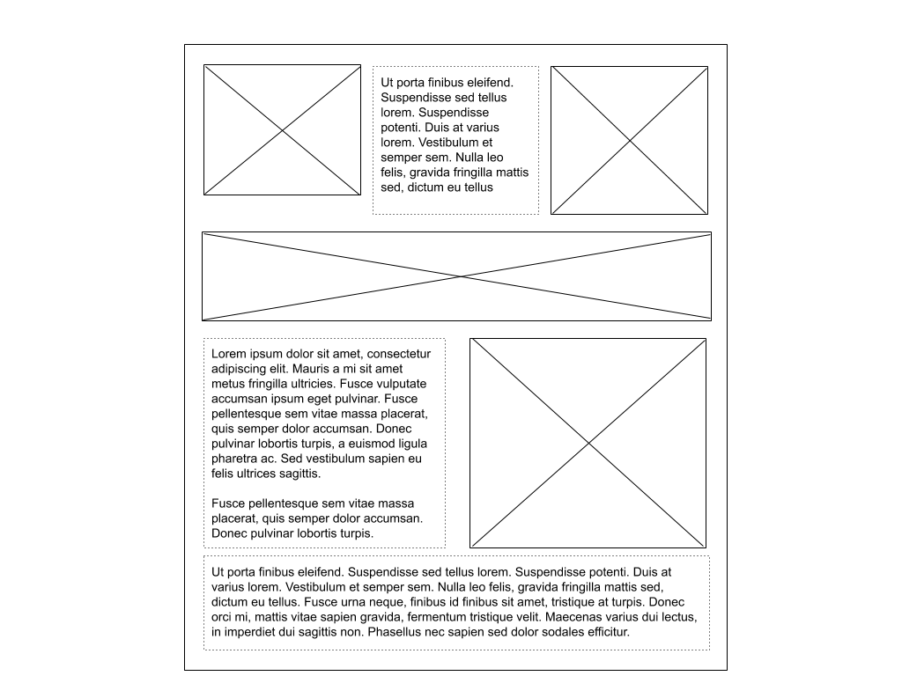
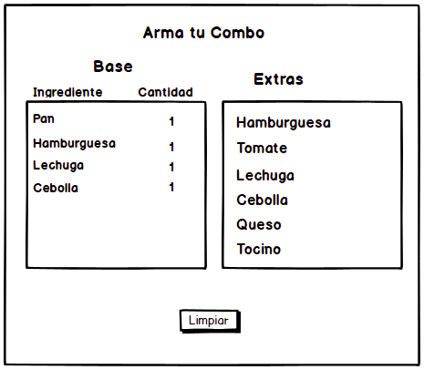

# I1

**Pauta general:** Pueden existir errores menores de sintaxis o métodos con nombres ligeramente distintos al correcto. Revisar supuestos escritos en las respuestas.

## Pregunta 1 (1 pts):

En los mundos fantásticos hay por lo general seres "standard" y seres mágicos "magicians". Para los seres estándar hay humans, hobbits, elfs, ghosts y trolls. Para los mágicos sólo tendremos magicians.

Sea la clase "raíz" llamada "*standard*" que tiene los siguientes atributos:

* `name`, (el nombre propio: Legolas, Bilbo, etc.)
* `health`,(un número mayor a cero)

Y los métodos/funciones:

* `chant()` que retorna un canto en consola que dice: "I am a [tipo]  fighting the [enemy]  with my [weapon]."
* `setHealth(number)`, que otorga ese *number* como *health*
* `getHealth()`, que retorna su *health* que tenga en el momento(número)
* `setName(varName)`, que otorga `varName` como *name*

Sea la clase "*magician*" que tiene los siguientes atributos:

* name (Gandalft, etc.)

Y los métodos/funciones:

* `setName(varName)`, que otorga `varName` como *name*
* `heal()` que aumenta en +50 la salud de alguien si y sólo si NO es un troll (si es troll retorna un mensaje en consola "I don't heal trolls!!"

Además están las siguientes clases (que heredan de "*standard*"):

* *human*: con atributos:  `enemy` trolls y `weapon`  sword (espada)
* *troll*: con atributos:  `enemy` humans y `weapon` club  (mazo)
* *hobbit*: con atributos:  `enemy` ghosts y `weapon` stones

a) **Parte 1:** Implemente las clases para *standard*, *human*, *troll*, *hobbit* y *magician*. Recuerda que *human*, *troll* y *hobbit* heredan de *standard*. La clase *magician* **no hereda** de *standard*.

b) **Parte 2:** Implemente el siguiente código según lo indicado más abajo.

En tu código debes hacer:

* Crear los personajes Bilbo (hobbit), Nasty (troll), Kirk (human) y Gandalf(magician)
* Darle nombre a todos los personajes usando `setName`
* Darle (usando `setHealth`) *health* de 100 a todos los seres creados (que tengan *health* como atributo)
* Entregar, usando el método apropiado, el valor para *health* de Bilbo, Kirk y Nasty
* Hagan que Gandalf (usando `heal`) sane a Bilbo, Kirk y Nasty
* Entregar el valor de *health* para Bilbo , Kirk y Nasty

 
La siguiente debe ser la salida en consola esperada para lo anterior:

```
I am a human  fighting the trolls  with my sword.
I am a troll  fighting the humans  with my club.
I am a hobbit  fighting the ghosts  with my stones.

Kirk. health: 100
Bilbo. health: 100
Nasty. health: 100

I don't heal trolls!!

Kirk. health: 150
Bilbo. health: 150
Nasty. health: 100
```

`NOTA:` Puedes ocupar cualquier sintaxis, para escribir e interacturar con clases, al desarrollar este ejercicio. Sin embargo, debes ser consistente a lo largo de toda tu respuesta. 

`NOTA2:` Cuando Gandalf sane a Biblo, Kirk y Nasty, el único mensaje que debe salir es: I don't heal trolls!

### Una solución

Por Hernán Cabrera

```js
const standard = {
  name:undefined,
  health:0,

  chant(){
     console.log("I am a ",this.type , " fighting the ", this.enemy, " with my ", this.weapon)
  },

  setHealth(number){
    this.health =  number;
  },

  getHealth(){
    return this.health;
  },

  setName(varName){
    this.name = varName
  }
} 

const magician= {
  name:undefined,

  heal(type){
    
    if(type === "troll") {
       console.log("\nI don´t heal trolls!\n") }
    else{ 
       this.health = this.health +50; }
  },

  setName(varName){
    this.name = varName
  }
}

// Objetos human, hobbit y troll

const human = { type: "human",
                enemy: "trolls",
                weapon: "sword"
              }
const hobbit  = { type: "hobbit",
                  enemy: "ghosts",
                  weapon: "stones"
                }
const troll = { type: "troll",
                enemy: "humans",
                weapon: "club"
              }

// Los objetos anteriores heredando de standard
// Si se hace con __proto__ descontar 2 décimas.

Reflect.setPrototypeOf(human, standard);
Reflect.setPrototypeOf(troll, standard);
Reflect.setPrototypeOf(hobbit,standard);

// Se crean a Kirk, Nasty y a Bilbo.

let Kirk = Object.create(human);
let Nasty = Object.create(troll);
let Bilbo = Object.create(hobbit);

let Gandalf = Object.create(magician);

// Se dan los nombres via setName 
// Si no se usa setName, descontar 1 décima.

Kirk.setName("Kirk");
Nasty.setName("Nasty");
Bilbo.setName("Bilbo");
Gandalf.setName("Gandalf");

// Se dan skills usando setSkill
// Si no se usa setSkill se descuenta 1 décima.
Kirk.setHealth(100);
Nasty.setHealth(100);
Bilbo.setHealth(100);

// Se canta.
Kirk.chant();
Nasty.chant();
Bilbo.chant();

//Se entrega el health de todos
console.log("\nHealth\n");

console.log("Kirk.health : ", Kirk.getHealth());
console.log("Bilbo.health: ", Bilbo.getHealth());
console.log("Nasty.health: ", Nasty.getHealth());

// Se sana a todos
Gandalf.heal.call(Kirk,  "human");
Gandalf.heal.call(Bilbo, "hobbit");
Gandalf.heal.call(Nasty, "troll");

//Se entregan la salud luego de sanar
console.log("\nLa salud luego de sanarlos\n");

console.log("Kirk.health : ", Kirk.getHealth());
console.log("Bilbo.health: ", Bilbo.getHealth());
console.log("Nasty.health: ", Nasty.getHealth());
```

### Otra solución

Por Hernán Cabrera

```js
class standard {

  constructor(){
      this.name = undefined;
      this.health = 0;
  }

  chant(){
     console.log("I am a ",this.type , " fighting the ",this.enemy, " with my ", this.weapon)
  }

  setHealth(number){
    this.health =  number;
  }

  getHealth(){
    return this.health;
  }

  setName(varName){
    this.name = varName
  }
} 

class magician {

  constructor() {
      this.name = undefined
  }

  heal(type){
    
    if(type === "troll") {
       console.log("\nI don´t heal trolls!\n") }
    else{ this.health = this.health +50; }
  }

  setName(varName){
    this.name = varName
  }
}

// Objetos human, hobbit y troll

class human extends standard {
      constructor(){
          super();
          this.type   = "human";
          this.enemy  = "trolls";
          this.weapon ="sword"
      }
}

class hobbit  extends standard {
      constructor(){
          super();
          this.type   = "hobbit";
          this.enemy  =  "ghosts";
          this.weapon = "stones"
       } 
}

class troll extends standard {
      constructor(){
          super();
          this.type   = "troll";
          this.enemy  = "humans";
          this.weapon = "club";
      }
}

// Se crean a Kirk, Nasty y a Bilbo.

let Kirk =  new human();
let Nasty = new troll();
let Bilbo = new hobbit();

let Gandalf = new magician();

// Se dan los nombres via setName 
// Si no se usa setName, descontar 1 décima.

Kirk.setName("Kirk");
Nasty.setName("Nasty");
Bilbo.setName("Bilbo");
Gandalf.setName("Gandalf");

// Se dan skills usando setSkill
// Si no se usa setSkill se descuenta 1 décima.
Kirk.setHealth(100);
Nasty.setHealth(100);
Bilbo.setHealth(100);

// Se canta.
Kirk.chant();
Nasty.chant();
Bilbo.chant();

//Se entrega el health de todos
console.log("\nHealth\n");

console.log("Kirk.health : ", Kirk.getHealth());
console.log("Bilbo.health: ", Bilbo.getHealth());
console.log("Nasty.health: ", Nasty.getHealth());

// Se sana a todos
Gandalf.heal.call(Kirk, "human");
Gandalf.heal.call(Bilbo, "hobbit");
Gandalf.heal.call(Nasty, "troll");

//Se entrega la salud luego de sanar
console.log("\nLa salud luego de sanarlos\n");

console.log("Kirk.health : ", Kirk.getHealth());
console.log("Bilbo.health: ", Bilbo.getHealth());
console.log("Nasty.health: ", Nasty.getHealth());
```

**Pauta:**

**Nota:** Aquí el ejercicio dice que se puede usar la sintaxis que el estudiante prefiera, esto es funciones, clases, utilizando la clase `Object` de Javascript u otro método.

Puntaje:

* Se crean todas las clases/objetos solicitadas: standard, magician, human, hobbit, troll: 0,1
* human, hobbit y troll (ya sea clase u objeto) heredan exitosamente de standard: 0,2
* Creación de los personajes como solicitado usando exclusivamente setName para dar los nombres: 0,1
* Por la salida correcta de chant() como solicitado en el enunciado para todos los personajes: 0,2
* Por la aplicación correcta de setHealth() (incluye salida en consola) y heal() para los personajes solicitados: 0,3
* Por salida a consola de la nueva health a los personajes que corresponda: 0,1  

## Pregunta 2 (2 pts):

Escribe el `HTML` y `CSS` (no `SCSS`) necesario para lograr un sitio con el siguiente layout:



Los cuadrados con líneas cruzadas corresponden a imágenes dentro del sitio que tienes que añadir. Es importante que respetes el posicionamiento y las filas de este layout. Como puedes ver en el ejemplo, si hay un elemento en la fila que es más grande que el otro, ese elemento debe desplazar a la siguiente fila más abajo. Todos los elementos de una fila deben partir desde una misma posición.

Las líneas punteadas en los textos es para que puedas ver la disposición fácilmente en el dibujo. Si quieres le puedes colocar el borde con una línea contínua, con línea punteada o sin línea. 

Tu layout debe estar centrado al visitar el sitio en el navegador.

Puedes agregar imágenes a tu respuesta desde internet, y si necesitas generar texto de prueba puedes visitar https://www.lipsum.com/


### Una solución

`HTML`

```html
<html>
  <head>
    <meta charset="UTF-8">
    <title>P2 - Posicionamiento</title>
    <link rel="stylesheet" href="app.css">
  </head>
  <body>
    <div id="container">
      <div class="content-row">
        
        <p>
          Aliquam laoreet feugiat justo, eu semper nisi vehicula in. Aliquam laoreet feugiat justo, eu semper nisi vehicula in. Aliquam laoreet feugiat justo, eu semper nisi vehicula in. Aliquam laoreet feugiat justo, eu semper nisi vehicula in. Aliquam laoreet feugiat justo, eu semper nisi vehicula in. Aliquam laoreet feugiat justo, eu semper nisi vehicula in. Sed efficitur lorem odio, id dapibus purus dapibus ac. Curabitur malesuada arcu ipsum. Vestibulum et arcu at tellus lacinia tincidunt. Donec feugiat odio vel posuere auctor
        </p>
        
      </div>
      <div class="content-row">
        
      </div>
      <div class="content-row">
        <p>
          Aliquam laoreet feugiat justo, eu semper nisi vehicula in. Aliquam laoreet feugiat justo, eu semper nisi vehicula in. Aliquam laoreet feugiat justo, eu semper nisi vehicula in. Aliquam laoreet feugiat justo, eu semper nisi vehicula in. Aliquam laoreet feugiat justo, eu semper nisi vehicula in. Aliquam laoreet feugiat justo, eu semper nisi vehicula in. Sed efficitur lorem odio, id dapibus purus dapibus ac. Curabitur malesuada arcu ipsum. Vestibulum et arcu at tellus lacinia tincidunt. Donec feugiat odio vel posuere auctor
        </p>
        
      </div>
      <div class="content-row">
        <p>
          Lorem ipsum dolor sit amet, consectetur adipiscing elit. Mauris nisl turpis, euismod sit amet volutpat vitae, dignissim quis magna. Duis ac porttitor erat. Vestibulum efficitur, diam quis tempus rutrum, dolor tellus porta enim, euismod varius tellus tortor quis nulla. Quisque semper arcu arcu, ut rutrum eros blandit a. Ut non nunc nec leo facilisis ornare sed et sapien. Ut euismod orci eu scelerisque congue. Mauris dignissim sodales nisl. Duis sit amet ornare leo. Proin rutrum commodo elementum. Fusce euismod nulla nisl, sit amet porttitor ligula scelerisque eu. Ut eleifend volutpat eros in vulputate. Maecenas ut metus mollis, ultrices felis at, condimentum purus. Nullam odio ligula, dignissim at dignissim ut, gravida non ipsum. Aliquam erat volutpat. Sed sem neque, lobortis ac enim et, euismod cursus justo. Vestibulum finibus ligula at bibendum eleifend.
        </p>
      </div>
    </div>
  </body>
</html>
```

`CSS`

```css
#container {
	margin: 0 auto;
	width: 800px;
}

.content-row {
  display: flex;
}

.content-row p, .content-row img {
  flex: 1;
}

p {
  border: 1px dashed black;
  padding: 5px;
  text-align: justify;
}

p, img {
  margin: 5px;
}

img.custom-height {
  height: 200px;
}
```

**Pauta:**

Revisar los supuestos.

Puede usarse tamaños estáticos en esta respuesta. También estilos responsivos.

Es posible utilizar cualquier método de posicionamiento (flex, float, grid, `display: inline`, etc). En este caso se usó `flex`.

**No puede tener estilos en el código `HTML`**, esto inmediatamente hace que la pregunta tenga 0 puntos. Tampoco el posicionamiento de elementos se puede hacer con tablas u otro elemento `HTML`, esto hará que el puntaje asociado al item de `CSS` sea cero.


**Puntaje:**

* HTML: 0.5 pts
  * Se encuentran todos los elementos necesarios
* CSS: 1.5 pt
  * 0.5 pts layout centrado (es válido que también hayan hecho un layout que use todo el ancho)
  * 0.25 pts Primera fila
  * 0.25 pts Segunda fila
  * 0.25 pts Tercera Fila
  * 0.25 pts Cuarta fila
    * Para los últimos 4 items: el puntaje es por tener los elementos ocupando una proporcion similar en la fila y que, al haber uno que ocupe mayor altura, desplace la fila siguiente más abajo.


## Pregunta 3 (3 pts):

Crea una página donde un usuario selecciona los ingredientes que quiere para su hamburguesa.

La interfaz se debe ver así:



Funcionamiento:

A la izquierda está la base de la hamburguesa y la cantidad de esa base que se incorpora, el número en la columna "cantidad" indica la porción, no se preocupen por la unidad de medida es "1 porción".

Al hacer clic en alguno de los elementos de la sección de la izquierda (Base) este elemento sale de la lista con las siguientes regla:

* Si hay más de una unidad para ese elemento, la cantidad se disminuye en 1.
* Si la cantidad es cero, sale el elemento de la lista junto a su indicador de cantidad (no pueden quedar elementos en la lista con valor cero ni tampoco un valor cero sin ningún elemento asociado).

**NOTA**: Esto es válido EXCEPTO para Pan y hamburguesa los cuales no se pueden eliminar.(Lo siento, no es un restaurante vegano). Es decir, no pueden tener valor cero NUNCA.

**NOTA 2**: Puede tener más de una hamburguesa el pedido (la base) pero nunca menos de 1.

**NOTA 3**: NO puede tener más de una unidad de pan.

Al hacer click en cualquiera de los Extras, que salen a la derecha, este elemento se agrega a la lista de la izquierda siguiendo la siguiente regla:

* Si el elemento YA existe, se incrementa su contador.
* Si el elemento no existe en el panel de la izquierda, se agrega a la lista de la izquierda y se incrementa el contador, para ese elemento, en 1 (en el panel de la izquierda que es el único que tiene contador)

**NOTA**: Los elementos de la lista de la derecha no se pueden sacar de la lista, siempre están allí

El botón "limpiar" elimina todo lo hecho y deja la pantalla TAL CUAL se ve en la imagen (que es la pantalla "Default"

Cree los archivos `html`, `css` y `js` para este ejercicio. Crea todas las funciones que requieras.

**NOTA**: En el sitio web, muestra tu pedido de hamburguesa centrado horizontalmente y con algo de margen superior.


### Una solución

Por Hernán Cabrera

`HTML`

```html
<!DOCTYPE html>
<html>
<head>
    <title>Pregunta 3 forma 2</title>
    <meta charset="UTF-8">
    <link rel="stylesheet" type="text/css" media ="screen" href="estilosPregunta3Forma2.css">
</head>

<body>
  
<div class="marco">

  <h1>Arma tu combo</h1>
  
  <h2 id = "txtbase">Base</h2>
  <h2 id = "txtextras">Extras</h2>
  
  <span id="txtingredientes">Ingredientes</span>
  <span id="txtcantidad">Cantidad</span>
  
  <div class="panelBase" id="panelBase" >
    <ul id="listaBase" class="listaBase">
      <li class = "base">Pan</li>
      <li class = "base">Hamburguesa</li>
      <li class = "base">Lechuga</li>
      <li class = "base">Cebolla</li>
    </ul>

    <ul id="listaCantidad" class="listaCantidad">
      <li class = "cantidad" id = "Pan">1</li>
      <li class = "cantidad" id = "Hamburguesa">1</li>
      <li class = "cantidad" id = "Lechuga">1</li>
      <li class = "cantidad" id = "Cebolla">1</li>
    </ul>
  </div>

  <div class="panelExtras" id="panelExtras" >
    <ul id="listaExtras">
      <li id="extra">Hamburguesa</li>
      <li id="extra">Tomate</li>
      <li id="extra">Lechuga</li>
      <li id="extra">Cebolla</li>
      <li id="extra">Queso</li>
      <li id="extra">Tocino</li>
     </ul>
  </div>

  <button class="boton" id="limpiar">Limpiar</button>

</div>

<script src="pregunta3Forma2.js"></script> 
</body>
</html>
```

`CSS`

```css
body {
       background-color: ivory;       
     }

h1 {
    text-align: center;
    font-family: sans-serif;
    color: darkblue;
    font-size: 33px;
    font-weight: bold;
    margin-top:30px;
}

#txtbase {
  position: absolute;
  color:green;
  top:125px;
  left:740px;
  font-family: sans-serif;
  font-size:24px;
}

#txtextras {
  position: absolute;
  color:green;
  left:1100px;
  top:125px;
  font-family: sans-serif;
  font-size:24px;
}

#txtingredientes {
  position: absolute;
  color:darkblue;
  left:620px;
  top:190px;
  font-size: 18px;
  font-weight: bold;
}

#txtcantidad {
  position: absolute;
  color:darkblue;
  left:845px;
  top:190px;
  font-size: 18px;
  font-weight: bold;
}

.marco {
  background-color: floralwhite;
  border: 2px solid teal;
  width: 40%;
  height: 550px;
  box-shadow: 5px 3px gray;
  margin: auto;
  margin-top:37px;
}

.panelBase {
    padding-left:100px;
    background-color:antiquewhite;
    width:320px;
    min-height: 200px;
    padding:3px;
    border: 2px solid darkblue;
    position: absolute;
    left: 610px;
    top: 220px;
    border-radius: 15px;
}

.panelExtras {
    padding-left:100px;
    background-color:antiquewhite;
    width:320px;
    min-height: 200px;
    padding:3px;
    border: 2px solid teal;
    position: absolute;
    left: 980px;
    top: 220px;
    border-radius: 15px;
}

.listaCantidad{
    position:absolute;
    margin-left: 267px;
    top:0px;
    list-style: none
}

ul {
    padding: 0px;
    margin-left: 37px;
    font-family: sans-serif;
    font-size:17px;
  }

li {
  margin-top:5px;
}

.boton {
   position: absolute;
   left: 1px;
   top: 1px;
   height: 40px;
   width: 90px;
   font-family: sans-serif;
   font-size: 19px;
   color: white;
   background-color: darkgreen;
   border-radius: 15px;
   left:900px;
   top:500px;
   box-shadow: 2px 2px darkgray;
}
```

`JS`

```js
// Se colocan listeners a todos los elementos.
setListeners();

function setListeners() {

   var limpiarElementos = document.getElementById("limpiar");
   var listItems = document.querySelectorAll('li');
   limpiarElementos.addEventListener("click", limpia);
   
   [].forEach.call(listItems, function(varItem) {  
              agregarListeners(varItem); });

}

// función agregarListeners(elemento) incorpora el listener para un elemento "li"
function agregarListeners(elemento) {

  elemento.addEventListener('click', identificaPanel, false);
}

// función cambiaPanel() se invoca al hacer click en algún elemento. Lo mueve de un panel al otro y actualiza montos del costo total.
function identificaPanel() {

    let texto = this.innerText;

    // Hice click en un elemento extra, se agrega o incrementa en "base"
    if(this.id === "extra") {   
        agregaExtras(texto);
     }
     // Hice click en un elemento que está en base (se descuenta)
     else {      
        var elemento = document.getElementById(texto);
        var numExtras = Number(elemento.innerText);
        quitaExtras(texto, numExtras);
    }
}

function quitaExtras(llave, cntExtras){

    var elemento = document.getElementById(llave);
         
    // La hamburguesa nunca puede ser cero ni el pan se puede modificar
    if( (llave === "Hamburguesa" && cntExtras === 1) || llave === "Pan" ){
        return;
    }
    
    cntExtras = cntExtras-1;
    
    if(cntExtras === 0){  // Se elimina el elemento si llega su cantidad a cero. Se saca ingrediente y cantidad
        
        var lista = document.getElementsByClassName("base");
        
        for( i =0; i<lista.length; i++) {
           if(lista.item(i).innerText === llave ){
             lista.item(i).remove();
             elemento.remove();
           }
        }
    }
    else{
       elemento.innerText = cntExtras;    
    }
}

function agregaExtras(llave){

    var elemento = document.getElementById(llave);
   
    if( elemento === null){ // Se inserta nuevo elemento en Base
      
       // Inserta en la lista de ingredientes (base)
       insertaLi("listaBase", "", "base", llave)
       
       // inserta en la lista de cantidad
       insertaLi("listaCantidad", llave, "cantidad", "1")
    }
    else { // El emenento ya está en la base, se incrementa la cantidad.
       var cantidad = Number(elemento.innerText); 
       elemento.innerText = cantidad +=1;
    }
}

// Insera los elementos (li) de ingredientes y cantidad, en la lista Base.
function insertaLi(lista, id, clase, texto){

    var ul = document.getElementById(lista);
    var li = document.createElement('li');

    li.className = clase;
    li.id = id;
    li.appendChild(document.createTextNode(texto));
    ul.appendChild(li);
    agregarListeners(li);
}


//función limpia() se ejecuta al presionar el botón limpiar. 
//Deja la pantalla como al inicio. Con una base de 1 unidad para pan, hamburguesa, Lechuga y Cebolla.

function limpia() {
  
    var li = document.getElementById("Hamburguesa")
    li.innerText = "1"  // La Hamburguesa nunca desaparece, solo se asigna a 1 su cantidad

    var lista = document.getElementsByClassName("base");

    // Este While quita todos los elementos (no sabemos si está en la lista o no Cebolla o Lechuga así que mejor se quita todo)
    while(lista.length>2) { // El elemento 0 siempre es pan, el 1 siempre Hamburguesa.
         
       var textoElemento = lista.item(2).innerText
       quitaExtras(textoElemento, 1);
    }
   
   agregaExtras("Lechuga");
   agregaExtras("Cebolla");
   
}
```

**Pauta:**

Se puede utilizar jQuery o Javascript directamente.

**No puede tener estilos ni `Javascript` en el código `HTML`**, esto inmediatamente hace que, en el caso de que tenga estilos en el `HTML` tenga cero puntos en los items de `HTML` y `CSS`. Si tiene código de comportamiento (`JS`) en el `HTML`, tendrá cero puntos en los items de `HTML` y `JS`. Si presenta código de comportamiento y estilos en el `HTML`, la pregunta tendrá cero puntos en total. Tampoco el posicionamiento de elementos se puede hacer con tablas u otro elemento `HTML`, esto equivale a tener cero puntos en el item de `CSS`.


**Puntaje:**
  * HTML: 0.5 pts
    * Elementos mínimos: Titulo, dos divs (paneles izquierdo y derecho), tres listas (dos de ellas en un mismo div) y un botón limpiar.
    * También los textos de Base, Extra, ingredientes, cantidad
    * El HTML debe tener las estructuras necesarias para crear la interface del enunciado.
  * CSS: 0.5 pts
    * Debe contener estilos para central la interfaz completa. 0.3 pts
    * Los elementos de cantidad no deben contener el bullet (se descuenta 0,1 de tener el bullet)
    * Los otros 0,2 puntos son para todo estilo extra que hayan puesto los alumnos para otorgar una interfaz más agradable.
  * JS: 2 pts
    * El pan no se modifica en cantidad y siempre está primero en la lista de ingredientes del panel izquierdo: 0,1
    * La hamburguesa no se elimina del listado izquierdo ni llega a cero,si cambian cantidades (aumenta o disminuye): 0,2
    * Se incrementa la cantidad de un ingrediente, en panel izquierdo, cada vez que se lo selecciona en el derecho: 0,4
    * Se añade un ingrediente inexistente en el panel izquierdo y con cantidad "1", si se lo selecciona en el derecho: 0,5
    * Se decrementa la cantidad de un ingrediente, en panel izquierdo, al seleccionarlo (se elimina si queda en cero): 0,5
    * Al presionar el boton Limpiar, todo se "resetea" y queda la pantalla como muesta el enunciado: 0,3
