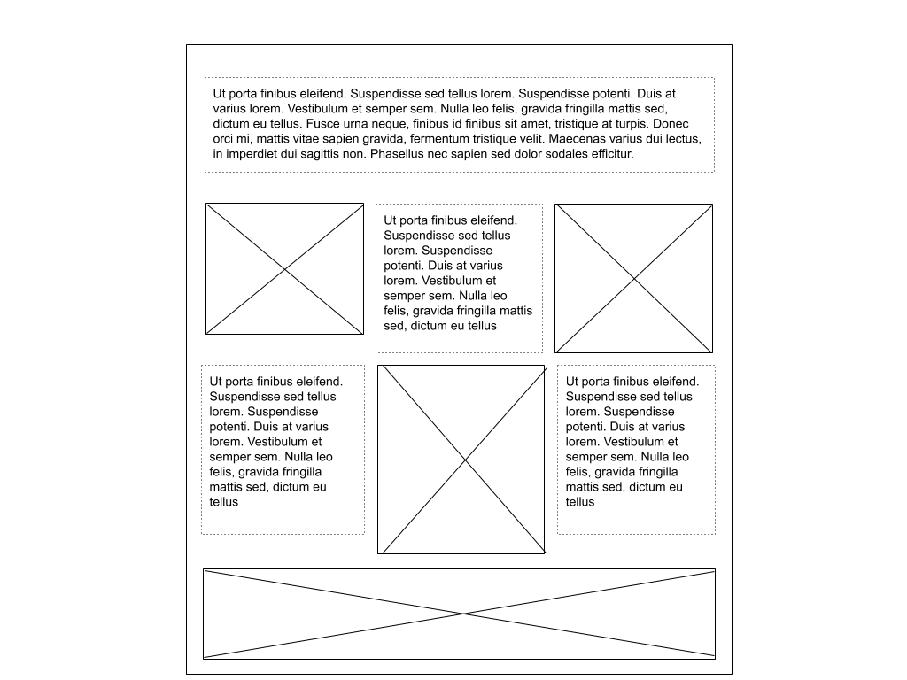
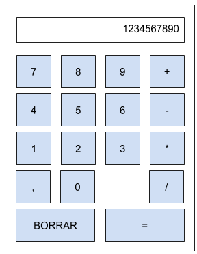

# I1

**Pauta general:** Pueden existir errores menores de sintaxis o métodos con nombres ligeramente distintos al correcto. Revisar supuestos escritos en las respuestas.

## Pregunta 1 (1 pts):

Como sabrás hay diferentes tipos de desarrolladores. Implementa las clases (puedes elegir la sintaxis que quieras) para que el siguiente código tenga la salida:

Código:

```js
const dev1 = new FullStackDeveloper('Dave');
const dev2 = new FrontendDeveloper('Mary');
const dev3 = new BackendDeveloper('Jane');

dev1.sayMyName();
dev2.sayMyName();
dev3.sayMyName();

dev1.tellWhatICanDo();
dev2.tellWhatICanDo();
dev3.tellWhatICanDo();

dev1.sayHiTo(dev2);
dev2.sayHiTo(dev3);
dev3.sayHiTo(dev1);

dev1.beEvil(); // Solo para FullStackDeveloper
```

Salida (en consola):

```
Hi! My name is Dave
Hi! My name is Mary
Hi! My name is Jane

I can code frontend and backend!
I can code just frontend!
I can code just backend!

Hi Mary!
Hi Jane!
Hi Dave!

I am the only one who understands both worlds! Muajajaja!
```

Para lo anterior debes considerar que todas las clases deben heredar de una (adicional si lo
deseas). Y debes aprovechar los beneficios de la herencia.


### Una solución

```js
class Developer {
  constructor(name) {
    this.name = name;
  }

  sayMyName() {
    console.log(`Hi! My name is ${this.name}`);
  }

  sayHiTo(dev) {
    console.log(`Hi! ${dev.name}!`);
  }
}

class FullStackDeveloper extends Developer {
  constructor(name) {
    super(name);
  }

  tellWhatICanDo() {
    console.log('I can code frontend and backend!');
  }

  beEvil() {
    console.log('I am the only one who understands both worlds! Muajajaja!');
  }
}

class FrontendDeveloper extends Developer {
  constructor(name) {
    super(name);
  }

  tellWhatICanDo() {
    console.log('I can code just frontend!');
  }
}

class BackendDeveloper extends Developer {
  constructor(name) {
    super(name);
  }

  tellWhatICanDo() {
    console.log('I can code just backend!');
  }
}
```

**Pauta:**

**Nota:** Aquí el ejercicio dice que se puede usar la sintaxis que el estudiante prefiera, esto es funciones, clases, utilizando la clase `Object` de Javascript u otro método.

Puntaje:

* 0.3 pts clase `Developer`
* 0.3 pts clase `FullStackDeveloper`
* 0.2 pts clase `FrontendDeveloper`
* 0.2 pts clase `BackendDeveloper`
  * 0.1 pts de los últimos 3 items es que hayan heredado correctamente (heredar e inicializar padre).


## Pregunta 2 (2 pts):

Escribe el `HTML` y `CSS` (no `SCSS`) necesario para lograr un sitio con el siguiente layout:



Los cuadrados con líneas cruzadas corresponden a imágenes dentro del sitio que tienes que añadir. Es importante que respetes el posicionamiento y las filas de este layout. Como puedes ver en el ejemplo, si hay un elemento en la fila que es más grande que el otro, ese elemento debe desplazar a la siguiente fila más abajo. Todos los elementos de una fila deben partir desde una misma posición.

Las líneas punteadas en los textos es para que puedas ver la disposición fácilmente en el dibujo. Si quieres le puedes colocar el borde con una línea contínua, con línea punteada o sin línea. 

Tu layout debe estar centrado al visitar el sitio en el navegador.

Puedes agregar imágenes a tu respuesta desde internet, y si necesitas generar texto de prueba puedes visitar https://www.lipsum.com/

### Una solución

`HTML`

```html
<html>
  <head>
    <meta charset="UTF-8">
    <title>P2 - Posicionamiento</title>
    <link rel="stylesheet" href="app.css">
  </head>
  <body>
    <div id="container">
      <div class="content-row">
        <p>
          Lorem ipsum dolor sit amet, consectetur adipiscing elit. Mauris nisl turpis, euismod sit amet volutpat vitae, dignissim quis magna. Duis ac porttitor erat. Vestibulum efficitur, diam quis tempus rutrum, dolor tellus porta enim, euismod varius tellus tortor quis nulla. Quisque semper arcu arcu, ut rutrum eros blandit a. Ut non nunc nec leo facilisis ornare sed et sapien. Ut euismod orci eu scelerisque congue. Mauris dignissim sodales nisl. Duis sit amet ornare leo. Proin rutrum commodo elementum. Fusce euismod nulla nisl, sit amet porttitor ligula scelerisque eu. Ut eleifend volutpat eros in vulputate. Maecenas ut metus mollis, ultrices felis at, condimentum purus. Nullam odio ligula, dignissim at dignissim ut, gravida non ipsum. Aliquam erat volutpat. Sed sem neque, lobortis ac enim et, euismod cursus justo. Vestibulum finibus ligula at bibendum eleifend.
        </p>
      </div>
      <div class="content-row">
        
        <p>
          Aliquam laoreet feugiat justo, eu semper nisi vehicula in. Aliquam laoreet feugiat justo, eu semper nisi vehicula in. Aliquam laoreet feugiat justo, eu semper nisi vehicula in. Aliquam laoreet feugiat justo, eu semper nisi vehicula in. Aliquam laoreet feugiat justo, eu semper nisi vehicula in. Aliquam laoreet feugiat justo, eu semper nisi vehicula in. Sed efficitur lorem odio, id dapibus purus dapibus ac. Curabitur malesuada arcu ipsum. Vestibulum et arcu at tellus lacinia tincidunt. Donec feugiat odio vel posuere auctor
        </p>
        
      </div>
      <div class="content-row">
        <p>
          Aliquam laoreet feugiat justo, eu semper nisi vehicula in. Aliquam laoreet feugiat justo, eu semper nisi vehicula in. Aliquam laoreet feugiat justo, eu semper nisi vehicula in. Aliquam laoreet feugiat justo, eu semper nisi vehicula in. Aliquam laoreet feugiat justo, eu semper nisi vehicula in. Aliquam laoreet feugiat justo, eu semper nisi vehicula in. Sed efficitur lorem odio, id dapibus purus dapibus ac. Curabitur malesuada arcu ipsum. Vestibulum et arcu at tellus lacinia tincidunt. Donec feugiat odio vel posuere auctor
        </p>
        
        <p>
          Aliquam laoreet feugiat justo, eu semper nisi vehicula in. Aliquam laoreet feugiat justo, eu semper nisi vehicula in. Aliquam laoreet feugiat justo, eu semper nisi vehicula in. Aliquam laoreet feugiat justo, eu semper nisi vehicula in. Sed efficitur lorem odio, id dapibus purus dapibus ac. Curabitur malesuada arcu ipsum. Vestibulum et arcu at tellus lacinia tincidunt. Donec feugiat odio vel posuere auctor
        </p>
      </div>
      <div class="content-row">
        
      </div>
    </div>
  </body>
</html>
```

`CSS`

```css
#container {
	margin: 0 auto;
	width: 800px;
}

.content-row {
  display: flex;
}

.content-row p, .content-row img {
  flex: 1;
}

p {
  border: 1px dashed black;
  padding: 5px;
  text-align: justify;
}

p, img {
  margin: 5px;
}

img.custom-height {
  height: 200px;
}
```

**Pauta:**

Revisar los supuestos.

Puede usarse tamaños estáticos en esta respuesta. También estilos responsivos.

Es posible utilizar cualquier método de posicionamiento (flex, float, grid, `display: inline`, etc). En este caso se usó `flex`.

**No puede tener estilos en el código `HTML`**, esto inmediatamente hace que la pregunta tenga 0 puntos. Tampoco el posicionamiento de elementos se puede hacer con tablas u otro elemento `HTML`, esto hará que el puntaje asociado al item de `CSS` sea cero.

**Puntaje:**

* HTML: 0.5 pts
  * Se encuentran todos los elementos necesarios
* CSS: 1.5 pt
  * 0.5 pts layout centrado (es válido que también hayan hecho un layout que use todo el ancho)
  * 0.25 pts Primera fila
  * 0.25 pts Segunda fila
  * 0.25 pts Tercera Fila
  * 0.25 pts Cuarta fila
    * Para los últimos 4 items: el puntaje es por tener los elementos ocupando una proporcion similar en la fila y que, al haber uno que ocupe mayor altura, desplace la fila siguiente más abajo.


## Pregunta 3 (3 pts):

Deberás crear usando `HTML` + `CSS` (No `SCSS`) + `JS` (Si quieres puedes utilizar `jQuery`) una calculadora. Tu creación debe verse, más o menos, así:



Al apretar los números, estos se van agregando al visor. Luego al apretar una operación es posible ingresar otro número y, finalmente, al apretar igual se muestra el resultado. Se debe poder operar inmediatamente con ese resultado. Puedes suponer que esta es la única vía de ingresar números y que no hay operaciones que violen las leyes de las matemáticas (por ejemplo, división por cero).

Al apretar la tecla borrar, la calculadora vuelve a su estado inicial (sin una operación activa y mostrando un cero en el visor).

En el sitio web, muestra tu calculadora centrada horizontalmente y con algo de margen superior.

### Una Solución

**HTML**

```html
<html>
  <head>
    <meta charset="UTF-8">
    <title>P3 - Calculadora</title>
    <link rel="stylesheet" href="app.css">
    <script src="https://code.jquery.com/jquery-3.5.1.min.js" integrity="sha256-9/aliU8dGd2tb6OSsuzixeV4y/faTqgFtohetphbbj0=" crossorigin="anonymous"></script>
    <script type="text/javascript" src="app.js"></script>
  </head>
  <body>
    <div id="calculator-container">
      <div class="calculator-numbers">
        <input id="number" type="text" disabled/>
      </div>
      <button type="button">7</button>
      <button type="button">8</button>
      <button type="button">9</button>
      <button type="button">+</button>
      <button type="button">4</button>
      <button type="button">5</button>
      <button type="button">6</button>
      <button type="button">-</button>
      <button type="button">1</button>
      <button type="button">2</button>
      <button type="button">3</button>
      <button type="button">*</button>
      <button type="button">,</button>
      <button type="button">0</button>
      <div></div>
      <button type="button">/</button>
      <button type="button" class="double-size">BORRAR</button>
      <button type="button" class="double-size">=</button>
    </div>
  </body>
</html>
```

**CSS**

```css
#calculator-container {
  border: 1px solid black;
  margin: 40px auto;
  padding: 10px;
  width: 400px;

  display: grid;
  grid-template-columns: repeat(4, 1fr);
  grid-gap: 10px;
}

.calculator-numbers {
  grid-column: span 4;
}

.calculator-numbers input[type=text] {
	height: 40px;
	text-align: end;
	width: 100%;
}

button {
  height: 40px;
}

button.double-size {
	grid-column: span 2;
}
```

**JS**

```js
var CLEAR_TEXT_BUTTON = 'BORRAR';
var EQUAL_TEXT_BUTTON = '=';
var DOT_TEXT_BUTTON = ',';

var number1 = '';
var number2 = '';
var currentOperation;

function clearCalculator() {
  number1 = '';
  number2 = '';
  currentOperation = undefined;
  $('input[type=text]').prop('value', 0);
}

function performOperation() {
  number1 = number1.replace(',', '.');
  number2 = number2.replace(',', '.');

  var n1 = Number(number1);
  var n2 = Number(number2);

  if (currentOperation === '+') return n1 + n2;
  else if (currentOperation === '-') return n1 - n2;
  else if (currentOperation === '*') return n1 * n2;
  else if (currentOperation === '/') return n1 / n2;

  return undefined;
}

$(function() {
  $('input[type=text]').prop('disabled', false);
  $('input[type=text]').prop('value', 0);

  $('button').click(function(event) {
    if (!isNaN(event.target.textContent) 
      || event.target.textContent === DOT_TEXT_BUTTON) {
        if(currentOperation) {
          number2 = `${number2}${event.target.textContent}`;
          $('input[type=text]').prop('value', number2);
        } else {
          number1 = `${number1}${event.target.textContent}`;
          $('input[type=text]').prop('value', number1);
        }
    } else if (event.target.textContent === CLEAR_TEXT_BUTTON) {
      clearCalculator();
    } else if (event.target.textContent === EQUAL_TEXT_BUTTON) {
      var result = performOperation();
      number1 = result.toString();
      number2 = '';
      currentOperation = undefined;
      $('input[type=text]').prop('value', number1);
    } else {
      currentOperation = event.target.textContent;
      $('input[type=text]').prop('value', 0);
    }
  });
});
```

**Pauta:**

Se puede utilizar jQuery o Javascript directamente.

Es posible utilizar cualquier método de posicionamiento (flex, float, `display: inline`, etc). En este caso se usó `grid`.

**No puede tener estilos ni `Javascript` en el código `HTML`**, esto inmediatamente hace que, en el caso de que tenga estilos en el `HTML` tenga cero puntos en los items de `HTML` y `CSS`. Si tiene código de comportamiento (`JS`) en el `HTML`, tendrá cero puntos en los items de `HTML` y `JS`. Si presenta código de comportamiento y estilos en el `HTML`, la pregunta tendrá cero puntos en total. Tampoco el posicionamiento de elementos se puede hacer con tablas u otro elemento `HTML`, esto equivale a tener cero puntos en el item de `CSS`.


**Puntaje:**

* HTML: 0.5 pts
  * Se encuentran todos los elementos necesarios
* CSS: 1 pt
  * (0.2 pts) Calculadora centrada y con margen superior
  * (0.6 pts) Disposición de teclas como la imagen de enunciado (ojo que la tecla faltante debe verse igual que si hubiese un botón)
  * (0.2 pts) Visor utiliza todo el ancho de la calculadora
* JS: 1.5 pts
  * (0.4 pts) Agregar numeros al visor
  * (0.5 pts) Reiniciar la calculadora (apretar tecla borrar)
  * (0.6 pts) Realizar distintas operaciones (probar con decimales)